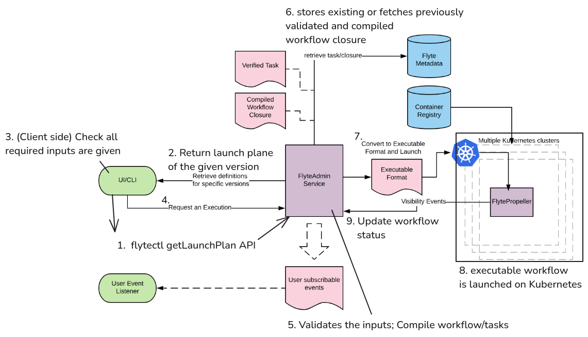

Ever wondered how Flyte orchestrates complex workflows across distributed systems? This article breaks down
Flyte's core architecture, exploring how its components work together to transform your Python code into
scalable, production-ready workflows.

## Overview

Flyte's architecture consists of three logical planes that work together seamlessly, namely user, control, and
data plane. For comprehensive details, see the [official
documentation](https://www.union.ai/docs/v1/flyte/architecture/component-architecture/).

- **User Plane**: Your interface to interact with the Flyte platform
    - **FlyteKit**: Python SDK for defining workflows, tasks, and launch plans using decorators
    - **FlyteConsole**: Web-based UI for visualizing workflows and monitoring executions
    - **FlyteCTL**: Command-line tool for interacting with Flyte cluster from your terminal
- **Control Plane**: The brain of Flyte that processes user requests and manages workflow lifecycle
    - **FlyteAdmin**: Central API server that validates inputs, compiles workflows into executable formats,
    and coordinates with the data plane
- **Data Plane**: The execution engine that runs workflows on Kubernetes and reports status back to the
control plane
    - **FlytePropeller**: Kubernetes controller that handles task reconciliation (ensuring actual state
    matches desired state) and invokes the appropriate FlytePlugin for task execution
    - **FlytePlugin**: Extensible plugins that handle different task types by creating pods or invoking
    Kubernetes operators

Here's how these components work together to execute a workflow:
1. User submits a workflow through FlyteKit, FlyteConsole, or FlyteCTL.
2. FlyteAdmin validates the input, compiles the workflow, and forwards it to FlytePropeller.
3. FlytePropeller selects the appropriate FlytePlugin to execute tasks and monitors progress until completion.

Now let's dive deeper into what happens during each step of workflow execution.

## Workflow Execution



Before detailing the workflow execution, we briefly introduce three key Flyte concepts:
launch plan, workflow, and task.
- **Launch plan**: Template that defines inputs and configuration for the workflow
- **Workflow**: Collection of tasks organized into a complete pipeline  
- **Task**: Individual unit of computation (e.g., data transformation, model training, etc.)

We'll discuss them in more detail in future articles.


The following steps illustrate how Flyte processes a workflow from client request to execution:

1. **Client requests launch plan**: The client sends a `getLaunchPlan` request to FlyteAdmin.
    - If no launch plan is explicitly set, a default launch plan is created with the same name as the workflow.
2. **FlyteAdmin returns launch plan**: FlyteAdmin responds with the requested launch plan details.
3. **Client validates inputs**: The client checks if all required inputs are provided based on the launch plan.
4. **Execution request submitted**: The client sends a workflow execution request to FlyteAdmin.
5. **FlyteAdmin processes request**: FlyteAdmin validates inputs and compiles the workflow and tasks.
6. **Metadata storage**: The compiled workflow is uploaded to Flyte's metadata storage (or fetched if
previously compiled).
7. **Workflow translation**: The compiled workflow is translated into a `flyteworkflow` custom resource (CR)
with inputs.
    - Custom Resource Definitions (CRDs) allow you to extend Kubernetes by defining your own
    resource types, similar to how built-in resources like Pod and Service are managed. A
    Custom Resource (CR) is an instance of such a type. Flyte uses this by defining a
    `flyteworkflow` CRD.
8. **FlytePropeller executes**: FlytePropeller retrieves the `flyteworkflow` CR, invokes appropriate
FlytePlugins for execution, and monitors execution status.
9. **Status updates**: FlytePropeller continuously reports workflow status back to FlyteAdmin.

These steps show how Flyte's components work together seamlessly. From user request to
workflow completion, each component plays a crucial role in ensuring reliable, scalable
execution.

## Summary

Flyte's three-plane architecture enables scalable workflow orchestration through clear separation of
responsibilities:

- **Client tools** (`FlyteKit`, `FlyteConsole`, `FlyteCTL`): Your interface for defining, submitting, and
monitoring workflows
- **FlyteAdmin**: Central control point that validates, compiles, and coordinates workflow execution
- **FlytePropeller**: Kubernetes controller that dispatch workflows and manages their lifecycle

This architectural design ensures reliability, scalability, and maintainability for production-grade workflow
orchestration.
