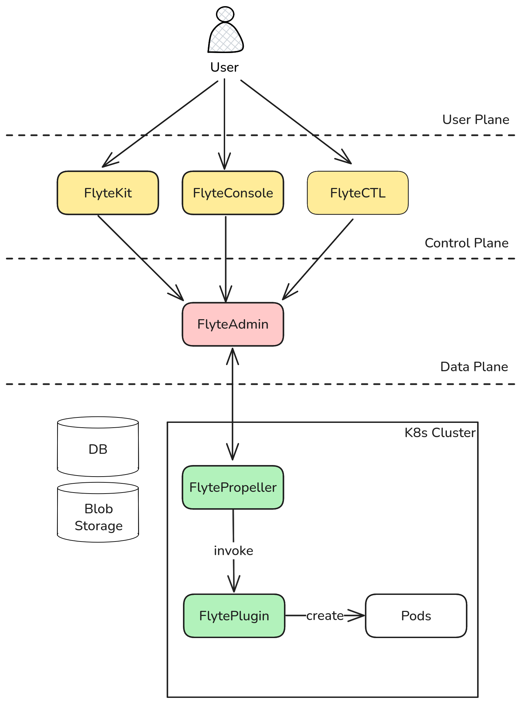

這篇文章將深入解析 Flyte 的核心架構，探討各個組件的職責以及如何共同運作構成 scalable +
production ready 的平台，用以執行 Python workflow。

## 概覽

Flyte 的架構可以分為三層，分別是用戶、控制、以及資料層。詳細資訊請參考[官方文件](https://www.union.ai/docs/v1/flyte/architecture/component-architecture/)。

- **用戶層**: 與 Flyte 互動的介面
    - **FlyteKit**: Python SDK，用於定義 workflow 及 task
    - **FlyteConsole**: 網頁 UI，用於視覺化 workflow 和監控執行狀況
    - **FlyteCTL**: CLI 工具，從終端機與 Flyte 叢集互動
- **控制層**: Flyte 的大腦，處理用戶請求並管理 workflow 和生命週期
    - **FlyteAdmin**: 中央 API 伺服器，驗證輸入、將 workflow 編譯成可執行的格式、以及與資料層溝通
- **資料層**: 在 Kubernetes 上執行 workflow 並向控制層回報狀態
    - **FlytePropeller**: Kubernetes 控制器，負責任務調和（確保實際狀態與期望狀態一致）並調用合適的 FlytePlugin 執行任務
    - **FlytePlugin**: 可擴展的外掛，透過建立 pod 或調用 Kubernetes operator 來處理不同類型的任務
        - Flyte 有許多串接各種運算引擎和雲端服務的 plugins，包括 Spark、Ray、PyTorch、Dask、AWS
        Batch、BigQuery、Snowflake 等等。
        [官方文件](https://www.union.ai/docs/v1/flyte/deployment/flyte-plugins/kubernetes-plugins/)中有列出詳細的
        plugin list 以及設定方式。

以下是這些組件如何相互搭配來執行 workflow:
1. 用戶透過 FlyteKit、FlyteConsole 或 FlyteCTL 建立 workflow
2. FlyteAdmin 驗證輸入、編譯 workflow，並將其轉發給 FlytePropeller
3. FlytePropeller 選擇適當的 FlytePlugin 來執行任務，並監控進度直到完成

現在讓我們深入了解執行 workflow 的每個步驟中發生了什麼。

## 執行 workflow



深入探討 Flyte workflow 怎麼被執行前，讓我們先來簡單介紹 3 個 Flyte 的核心概念: launch
plan、workflow、以及 task。
- **launch plan**: 定義 workflow 輸入的模板
- **workflow**: 由多個 task 組合成的完整流水線
- **task**: 個別的計算單元（例如資料轉換、模型訓練等）

這些是核心組件的簡要說明 - 之後會有更詳細的介紹文章。


以下的步驟描述 Flyte 從 user request 到執行 workflow 的流程:

1. **客戶端發送 launch plan 請求**: 客戶端向 FlyteAdmin 發送取得 launch plan 的請求 (`getLaunchPlan`)
    - 如果沒有明確設定 launch plan，會建立一個與 workflow 同名的預設 launch plan
2. **FlyteAdmin 回傳 launch plan**: FlyteAdmin 回傳客戶端要的 launch plan
3. **客戶端驗證輸入**: 客戶端檢查 launch plan 是否提供了所有 workflow 需要的 input
4. **提交執行請求**: 客戶端向 FlyteAdmin 發送 workflow 執行請求
5. **FlyteAdmin 處理請求**: FlyteAdmin 驗證輸入並編譯 workflow 和 task
6. **中繼資料儲存**: 編譯後的 workflow 上傳到 Flyte 的 metadata storage（如果之前已編譯過，則直接從 storage 中拿取）
7. **workflow 轉換**: 編譯後的 workflow 會與輸入結合，轉換為 custom resource (CR) `flyteworkflow`
    - CustomResourceDefinitions (CRDs) 讓你可以透過定義自己的資源類型來擴展 Kubernetes，
    像是 Pod 和 Service 都是一個 CRD。 Flyte 透過 `flyteworkflow` CRD 來讓 Kubernetes
    能夠理解和管理 workflow。
8. **FlytePropeller 執行**: FlytePropeller 存取 `flyteworkflow` CR，調用適當的 FlytePlugin 來執行 workflow，並監控執行狀態
9. **狀態更新**: FlytePropeller 持續向 FlyteAdmin 回報 workflow 狀態

## 總結

Flyte 的三層架構區分出明確的職責: 

- **客戶端工具** (`FlyteKit`、`FlyteConsole`、`FlyteCTL`): 定義、提交和監控 workflow 的介面
- **FlyteAdmin**: 驗證、編譯和協調 workflow 執行的中央控制器
- **FlytePropeller**: Kubernetes 控制器，負責調用合適的工具來執行 workflow 並管理其生命週期

這樣的架構設計讓 Flyte 在生產環境中能夠穩定運行、輕鬆擴展，同時保持良好的維護性。
