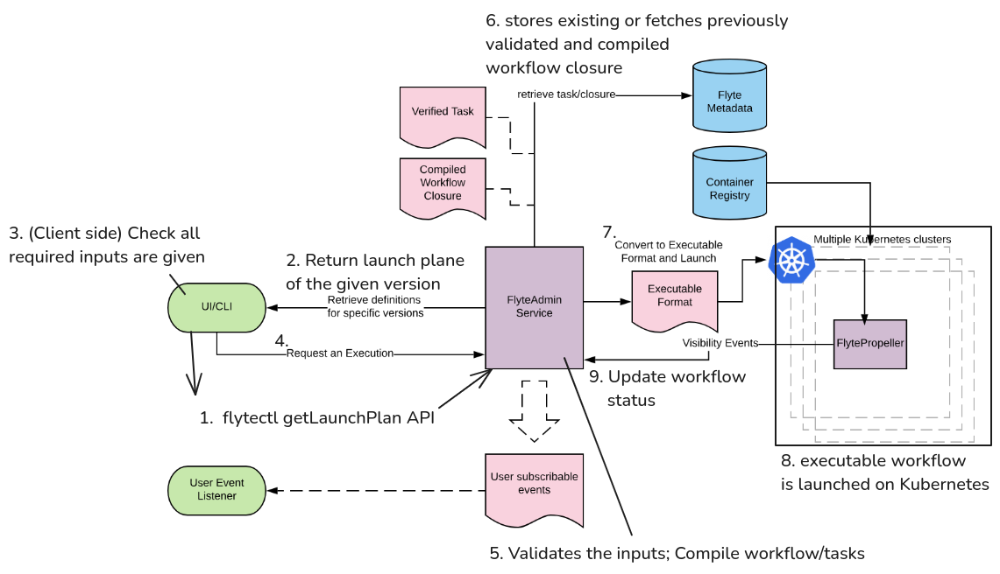

這篇文章將深入解析 Flyte 的核心架構，探討各個組件的職責以及如何共同運作構成 scalable +
production ready 的平台，用以執行 Python workflow。

## 概覽

Flyte 的架構可以分為三層，分別是用戶、控制、以及資料層。詳細資訊請參考[官方文件](https://www.union.ai/docs/v1/flyte/architecture/component-architecture/)。

- **用戶層**：與 Flyte 互動的介面
    - **FlyteKit**：Python SDK，用於定義 workflow 及 task
    - **FlyteConsole**：網頁 UI，用於視覺化 workflow 和監控執行狀況
    - **FlyteCTL**：CLI 工具，從終端機與 Flyte 叢集互動
- **控制層**：Flyte 的大腦，處理用戶請求並管理 workflow 和生命週期
    - **FlyteAdmin**：中央 API 伺服器，驗證輸入、將工作流程編譯成可執行格式、以及與資料層協調
- **資料層**：在 Kubernetes 上執行 workflow 並向控制層回報狀態
    - **FlytePropeller**：Kubernetes 控制器，負責任務調和（確保實際狀態與期望狀態一致）並調用合適的 FlytePlugin 執行任務
    - **FlytePlugin**：可擴展的外掛，透過建立 pod 或調用 Kubernetes operator 來處理不同類型的任務

以下是這些組件如何相互搭配來執行 workflow:
1. 用戶透過 FlyteKit、FlyteConsole 或 FlyteCTL 建立 workflow
2. FlyteAdmin 驗證輸入、編譯 workflow，並將其轉發給 FlytePropeller
3. FlytePropeller 選擇適當的 FlytePlugin 來執行任務，並監控進度直到完成

現在讓我們深入了解執行 workflow 的每個步驟中發生了什麼。

## 執行工作流程

讓我們詳細了解每個組件在 workflow 執行期間的作用。


Flyte 工作流程有 3 個主要組件：launch plan、workflow 和 task。
- **launch plan**：定義 workflow 輸入的模板
- **workflow**：由多個 task 組合成的完整流水線
- **task**：個別的計算單元（例如資料轉換、模型訓練等）

這些是核心組件的簡要說明 - 之後會有更詳細的介紹文章。


1. **客戶端發送 launch plan 請求**：客戶端向 FlyteAdmin 發送取得 launch plan 的請求 (`getLaunchPlan`)
    - 如果沒有明確設定啟動計畫，會建立一個與工作流程同名的預設啟動計畫
2. **FlyteAdmin 回傳 launch plan**：FlyteAdmin 回傳客戶端要的 launch plan
3. **客戶端驗證輸入**：客戶端檢查 launch plan 是否提供了所有 workflow 需要的 input
4. **提交執行請求**：客戶端向 FlyteAdmin 發送 workflow 執行請求
5. **FlyteAdmin 處理請求**：FlyteAdmin 驗證輸入並編譯 workflow 和 task
6. **中繼資料儲存**：編譯後的工作流程上傳到 Flyte 的中繼資料儲存（如果之前已編譯過，則從中繼資料儲存中擷取）
7. **工作流程轉換**：編譯後的工作流程轉換為帶有輸入的 `flyteworkflow` 自訂資源 (CR)
    - 自訂資源 (CR) 讓你可以在 Kubernetes 中建立自己的資源類型，就像 Kubernetes 有 pod 和 service 一樣。Flyte 使用這個功能建立 `flyteworkflow` 資源類型，讓 Kubernetes 能夠理解和管理
8. **FlytePropeller 執行**：FlytePropeller 擷取 `flyteworkflow` CR，調用適當的 FlytePlugin 執行，並監控執行狀態
9. **狀態更新**：FlytePropeller 持續向 FlyteAdmin 回報工作流程狀態

這些步驟顯示了 Flyte 的組件如何無縫協作。從用戶請求到工作流程完成，每個組件都發揮關鍵作用，確保可靠、可擴展的執行。

## 總結

Flyte 的三層架構透過清楚的職責分工，實現了可擴展的工作流程協調：

- **客戶端工具** (`FlyteKit`、`FlyteConsole`、`FlyteCTL`)：定義、提交和監控工作流程的介面
- **FlyteAdmin**：驗證、編譯和協調工作流程執行的中央控制點
- **FlytePropeller**：在 Kubernetes 上執行工作流程並管理其生命週期的原生執行引擎

這種架構設計確保了生產級工作流程協調的可靠性、可擴展性和可維護性。
