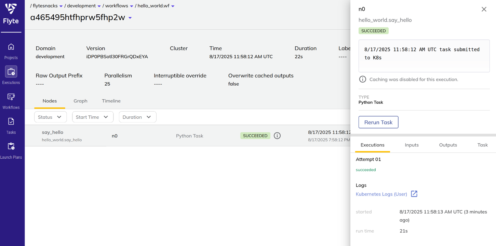

Since the term *big data* first introduced in the early 1990s, the volume of global data has grown at an exponential pace. As machine learning continues to rise, companies are building countless AI pipelines to solve real-world business problems, from predicting ad clicks to personalizing recommendations.


 

At its core, an AI pipeline can be thought of as:

$$
\text{AI Pipeline = Code + Data [2]}
$$

But in practice, building and managing these pipelines is far from simple. Developers often face two major problems:

1. **Multi-cluster deployment** - Reliably ship code to production at scale, without endless manual fixes
    - 🤕 **Wihtout Flyte**: User need to manually setup clusters for different domains
    (e.g. development and production), and need to take care of moving workflow between
    domains and clusters.
    - 😄 **With Flyte**: Simply execute the workflow with arguments `--domain` specifying
    "development" or "production", Flyte will determine where to run the code for you! If
    any node failed, Flyte will automatically transfer the workflow to other available
    nodes!
2. **Data flow** - Ensure data moves smoothly across a complex workflow of preprocessing, model training, serving, and evaluation
    - Without Flyte: 
    - With Flyte: 

To address these pain points, Lyft created Flyte [3], an open-source orchestration platform designed to support tens of thousands of AI pipelines at scale.

## Features

Flyte tackles five specific challenges that AI teams commonly face:

1. **Scalability** - Handle massive growth in requests and data with efficient concurrency
    - Buliding upon Kubernetes, Flyte is deeply integrated with it and can assign and move
      workflows between clusters with ease, being able to handle scaling and node failure
      cases.
2. **Reusability** - Reuse components across pipelines and business units, avoiding “reinventing the wheel."
    - Caching the output of tasks for re-using to save time and compute resources
3. **Reproducibility** - Ensure experiments can be replicated by mirroring dev environments in production
    - Flyte enables users to set the packages and resources needed for the task, which can
      be used accross any clusters, ensuring the consistency to the result.
4. **Maintainability** - Operate and update thousands of pipelines with ease
    - Exposes simple SDK interface and separates workflow management from execution,
    allowing users to define workflows once in a central location and run them across
    multiple compute clusters as needed.

") 

5. **Extensibility** - Integrate smoothly with third-party tools and services
    - Enable running tasks on popular data platforms like Databricks, Snowflake, and AWS
    Batch while still providing centralized workflow management, monitoring, and error
    handling

Today, Flyte is trusted by leading companies such as Tesla, Spotify, LinkedIn, and Toyota, and runs over 30 million tasks per day. For example, in a recent LinkedIn Engineering blog [4], the team unveiled their next-generation AI pipelines powered by Flyte, achieving 20–30× faster training and launch times, while enabling them to train models 200× larger than before.


## How to Run a Workflow in Flyte?

The Flyte workflow can be defined through simple Python syntax that is similar to other
workflow orchastration tools.

```python
import flytekit as fl


@fl.task
def say_hello(name: str) -> str:
    return f"Hello, {name}!"


@fl.workflow
def wf(name: str = "world") -> str:
    greeting = say_hello(name=name)
    return greeting
```


After defining the workflow, we can either executing it locally by `pyflyte run task.py
wf` for debugging locally or running on remote with `pyflyte run --remote task.py wf`.
When running on remote, Flyte automatically creates Kubernetes pods to execute tasks and
provides real-time status updates.

The command prints a URL to access Flyte Console, a web dashboard for monitoring workflow
progress, viewing logs, and managing operations like retries.

```sh
❯ pyflyte run --remote hello_world.py wf
Running Execution on Remote.

[✔] Go to http://localhost:30080/console/projects/flytesnacks/domains/development/executions/a465495htfhprw5fhp2w to see execution in the console.
```

 


## References
[1] [Amount of Data Created Daily (2025)](https://explodingtopics.com/blog/data-generated-per-day) <br>
[2] [A Chat with Andrew on MLOps: From Model-centric to Data-centric AI](https://www.youtube.com/watch?v=06-AZXmwHjo) <br>
[3] [Flyte OSS](https://www.union.ai/docs/v1/flyte/user-guide/) <br>
[4] [OpenConnect: LinkedIn’s next-generation AI pipeline ecosystem](https://www.linkedin.com/blog/engineering/infrastructure/openconnect-linkedins-next-generation-ai-pipeline-ecosystem) <br>
[5] [On Orchestrators: You Are All Right, But You Are All Wrong Too](https://dlthub.com/blog/on-orchestrators) <br>
